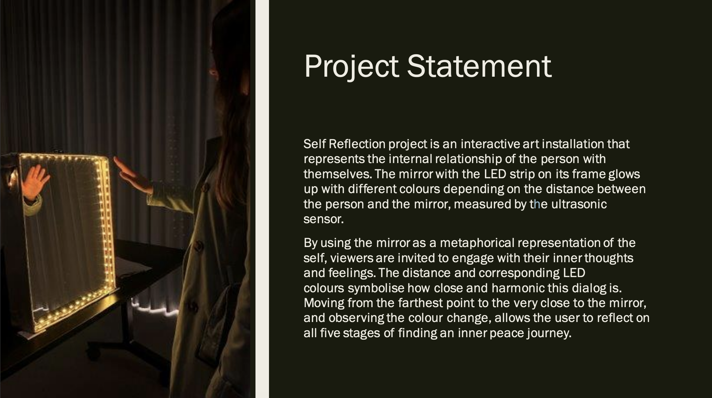
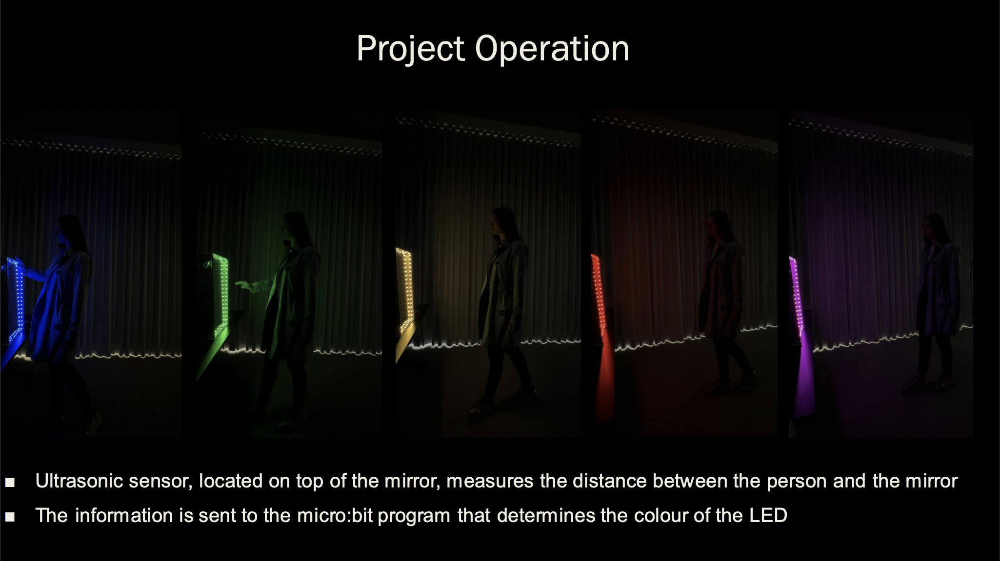
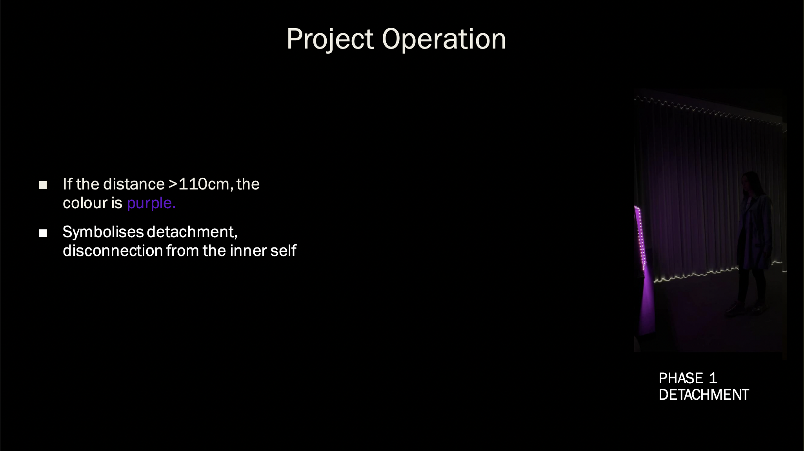
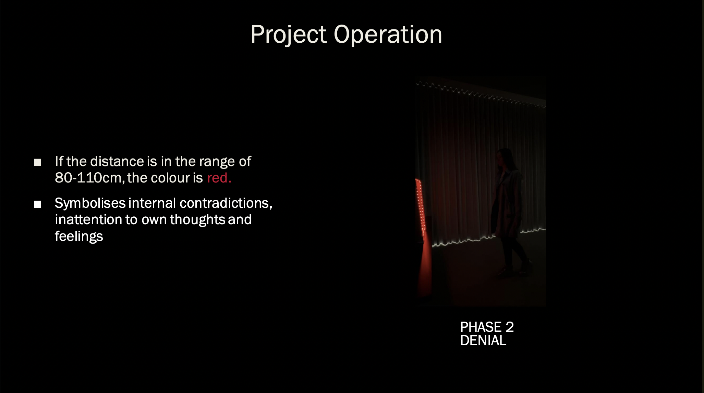
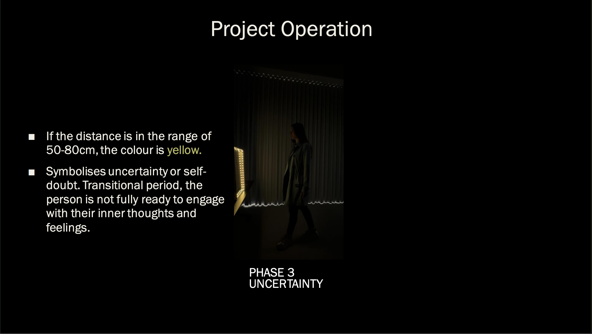
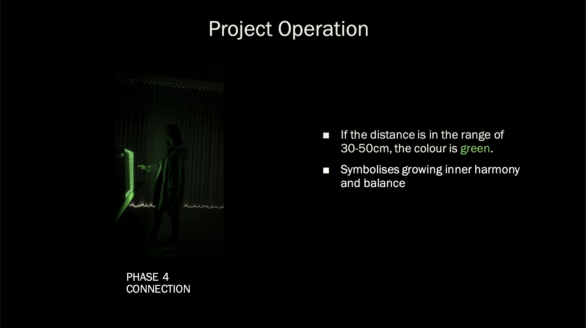
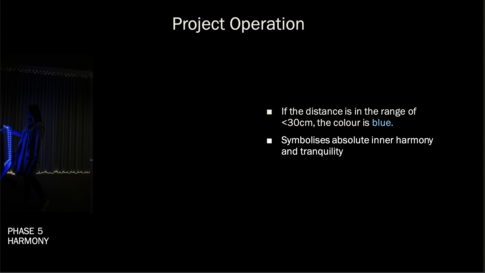
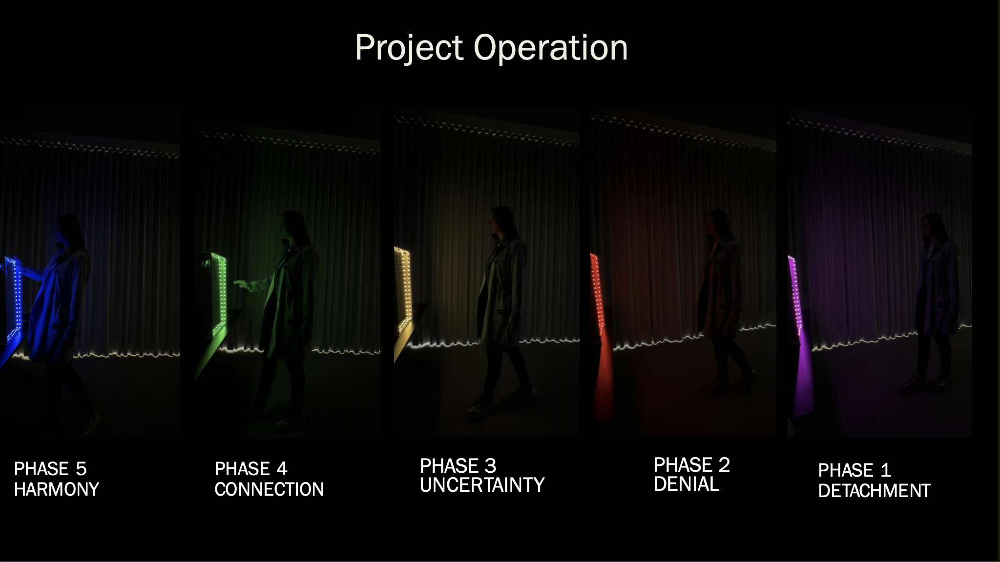
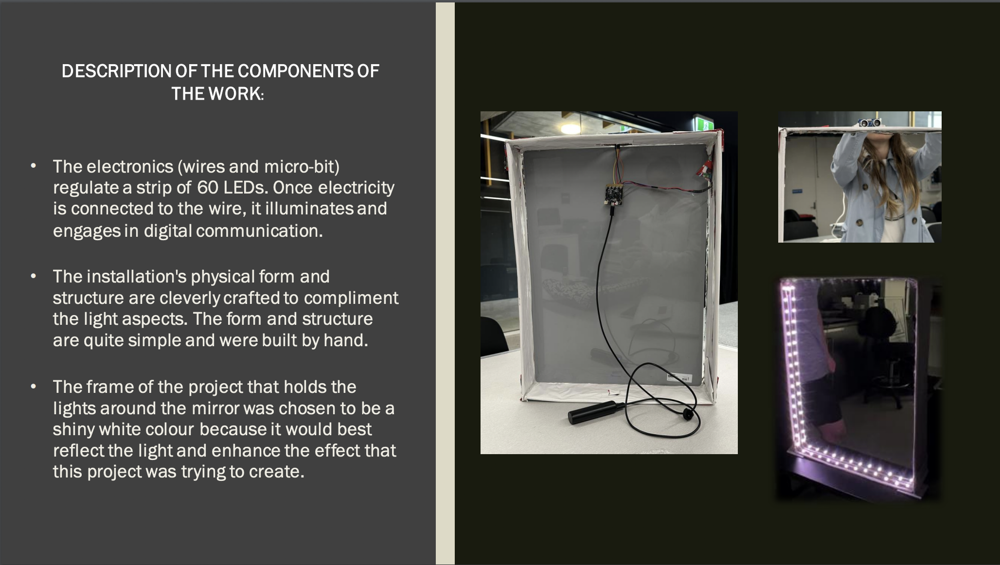

 
This project was created together with Michaela Perea and Liam McMichael for Introduction to Interactive Media class at UniSC.

## Copyright Notice

Copyright (c) 2025 Yuliia Kruta, Michaela Perea, Liam McMichael. All rights reserved.

This project is not licensed for reuse, redistribution, or modification without explicit permission from the authors.
